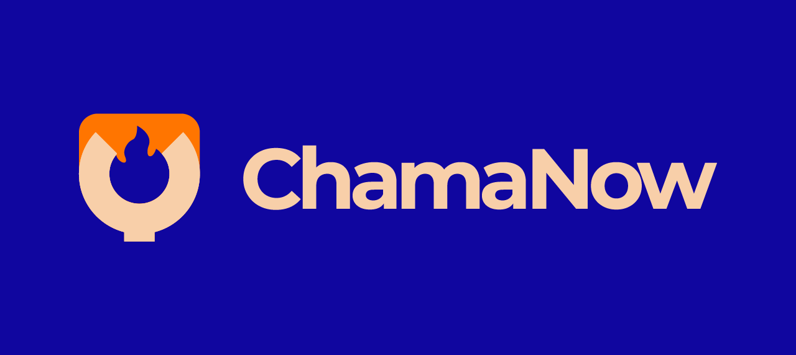

<h1 align="center">
  
</h1>

Aplicação desenvolvida para a disciplina de <strong>"Trabalho Interdisciplinar: Aplicações Para Processos de Negócios"</strong>, com propósito de estudo.

# ChamaNow 🔥

Por muitas vezes precisamos de serviços de reparos em casa. Mas não temos tempo, conhecimento ou ferramentas adequadas para fazer o reparo, o que causa enormes transtornos até conseguir contratar uma empresa (que pode sair muito caro) ou conseguir a indicação de algum profissional (o que pode demorar). Por outro lado, profissionais que trabalham com esses reparos são encontrados principalmente na base de indicações de cliente, o famoso boca a boca, que podem gerar demanda irregular de serviços e acrescentar um nível de instabilidade financeira ao profissional.

Nosso objetivo é criar um projeto para resolver esse problema, fazendo a ponte entre o cliente e o profissional. Prezamos por dar segurança ao cliente e criar um ambiente favorável e de fácil uso ao profissional.

## Integrantes

* Daniel Jost Andrade
* Douglas Viana Fernandes
* Frederico dos Santos Ferreira de Andrade
* Igor De Oliveira Martins Dos Santos
* Nikolas Augusto Vieira Louret

## Professores

* Hugo Bastos De Paula
* Joyce Christina De Paiva Carvalho

## Instruções de utilização

## Caso Cliente: 
- entrar no localhost;
- ir para a página inicial;
- criar uma conta;
- efetuar o login;
- procurar um prestador cadastrado;
- informar o seu problema;
- escolher data e horário;
- enviar o comprovante de serviço;
- concluir o serviço;
- avaliar o prestador.

## Caso Prestador: 
- entrar no localhost;
- ir para a página inicial;
- criar uma conta;
- efetuar o login;
- esperar um cliente contratá-lo;
- aceitar o problema;
- escolher data e horário;
- enviar o orçamento;
- concluir o serviço;
- avaliar o cliente.
